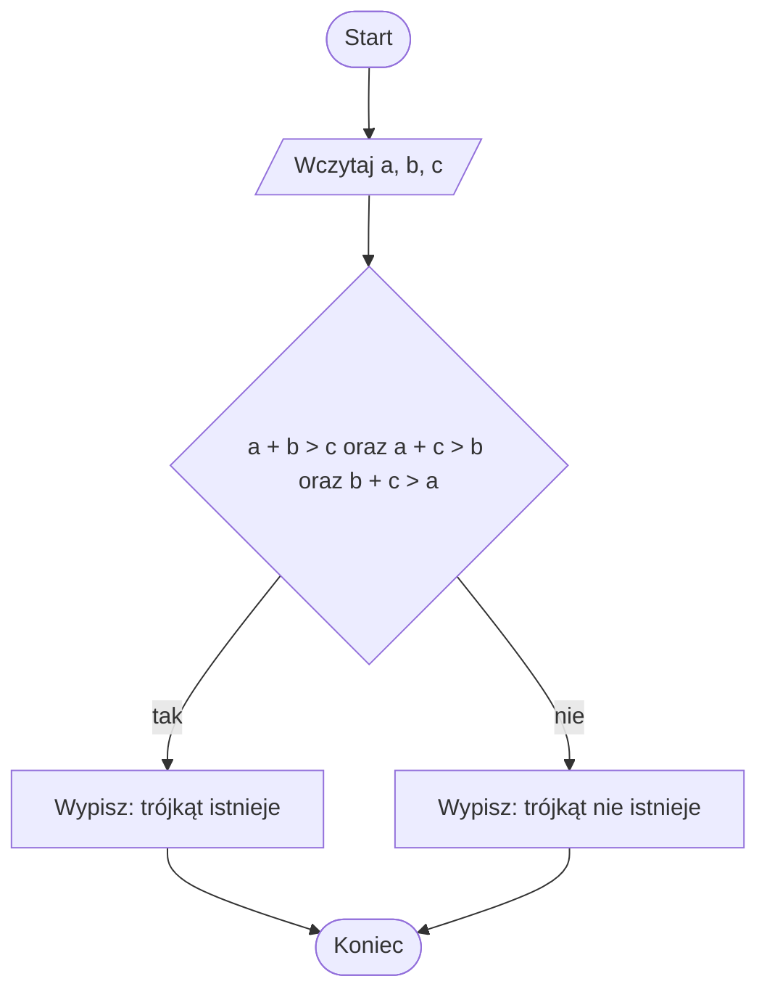

# Warunek istnienia trójkąta

## Problem po ludzku

Mamy trzy odcinki. Chcemy sprawdzić, czy da się z nich zbudować trójkąt.

Nie każde trzy odcinki tworzą trójkąt. Jeżeli jeden odcinek jest za długi, dwa pozostałe nie dosięgną do jego końców.

## Prosta analogia

Wyobraź sobie trzy patyczki. Próbujesz ułożyć z nich zamknięty kształt. Jeśli najdłuższy patyczek jest krótszy niż suma dwóch pozostałych, można zamknąć trójkąt.

Jeśli najdłuższy patyczek jest równy albo dłuższy od sumy dwóch pozostałych, trójkąt się nie zamknie.

## Dane wejściowe i wynik

Dane wejściowe:

- długość pierwszego boku,
- długość drugiego boku,
- długość trzeciego boku.

Wynik:

- informacja, czy z podanych boków można zbudować trójkąt.

## Rozwiązanie krok po kroku

1. Wczytaj trzy długości boków.
2. Sprawdź, czy suma dwóch pierwszych boków jest większa od trzeciego.
3. Sprawdź, czy suma pierwszego i trzeciego boku jest większa od drugiego.
4. Sprawdź, czy suma drugiego i trzeciego boku jest większa od pierwszego.
5. Jeżeli wszystkie trzy warunki są spełnione, trójkąt istnieje.
6. W przeciwnym razie trójkąt nie istnieje.

## Przykład wykonany ręcznie

Dane:

```text
a = 3
b = 4
c = 5
```

Sprawdzamy:

```text
3 + 4 > 5, czyli 7 > 5 - prawda
3 + 5 > 4, czyli 8 > 4 - prawda
4 + 5 > 3, czyli 9 > 3 - prawda
```

Wszystkie warunki są prawdziwe, więc trójkąt istnieje.

Drugi przykład:

```text
a = 2
b = 3
c = 6
```

Sprawdzamy:

```text
2 + 3 > 6, czyli 5 > 6 - fałsz
```

Jeden warunek jest fałszywy, więc trójkąt nie istnieje.

## Dlaczego algorytm działa

W trójkącie każdy bok musi być krótszy niż suma dwóch pozostałych boków. Gdyby jeden bok był zbyt długi, dwa krótsze boki nie mogłyby się połączyć.

Dlatego trzeba sprawdzić wszystkie trzy nierówności.

## Schemat blokowy



## Najczęstsze błędy

- Sprawdzenie tylko jednego warunku.
- Użycie znaku `>=` zamiast `>`.
- Zapomnienie o konwersji danych z `input()` na liczbę.
- Myślenie, że trzy dowolne dodatnie liczby zawsze tworzą trójkąt.
- Zapisanie warunku bez operatora `and`.

## Spróbuj wyjaśnić własnymi słowami

Odpowiedz na pytania:

1. Dlaczego najdłuższy bok nie może być zbyt długi?
2. Dlaczego sprawdzamy trzy warunki, a nie jeden?
3. Co oznacza warunek `a + b > c`?

## Implementacja w Pythonie

<details markdown="1">
<summary>Pokaż implementację w Pythonie</summary>

```python
a = float(input("Podaj długość pierwszego boku: "))
b = float(input("Podaj długość drugiego boku: "))
c = float(input("Podaj długość trzeciego boku: "))

if a + b > c and a + c > b and b + c > a:
    print("Z podanych boków można zbudować trójkąt.")
else:
    print("Z podanych boków nie można zbudować trójkąta.")
```

</details>

## Ćwiczenia

1. Sprawdź ręcznie, czy boki `5`, `5`, `8` mogą utworzyć trójkąt.
2. Sprawdź ręcznie, czy boki `1`, `2`, `3` mogą utworzyć trójkąt.
3. Uruchom program dla kilku własnych przykładów.
4. Zmień komunikaty programu na własne.
5. Wyjaśnij w zeszycie, dlaczego w warunku używamy `and`.
