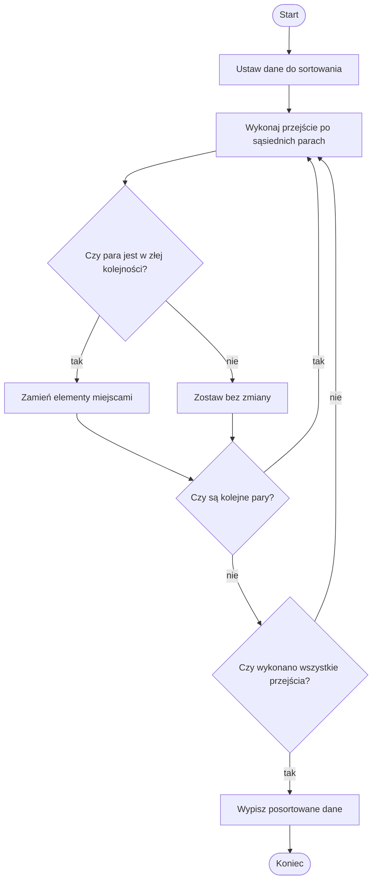

# Sortowanie bąbelkowe

## Problem po ludzku

Mamy kilka liczb ustawionych w przypadkowej kolejności. Chcemy ułożyć je od najmniejszej do największej.

Sortowanie bąbelkowe robi to bardzo prostą metodą: porównuje sąsiednie liczby i zamienia je miejscami, jeśli są w złej kolejności.

## Prosta analogia

Wyobraź sobie uczniów stojących w szeregu według wzrostu, ale pomieszanych. Nauczyciel idzie od lewej do prawej i porównuje tylko dwie osoby obok siebie.

Jeśli wyższa osoba stoi przed niższą, zamieniają się miejscami. Po kilku przejściach wszyscy stoją w dobrej kolejności.

## Dane wejściowe i wynik

Dane wejściowe:

- kilka liczb w dowolnej kolejności.

Wynik:

- te same liczby ustawione rosnąco.

## Rozwiązanie krok po kroku

1. Weź kolejne dwie sąsiednie liczby.
2. Sprawdź, czy pierwsza jest większa od drugiej.
3. Jeśli tak, zamień je miejscami.
4. Przejdź do następnej pary.
5. Powtarzaj przejścia, aż liczby będą uporządkowane.

## Przykład wykonany ręcznie

Dane:

```text
4 2 5 1
```

Pierwsze przejście:

```text
4 i 2 - zła kolejność, zamiana: 2 4 5 1
4 i 5 - dobra kolejność: 2 4 5 1
5 i 1 - zła kolejność, zamiana: 2 4 1 5
```

Drugie przejście:

```text
2 i 4 - dobra kolejność: 2 4 1 5
4 i 1 - zła kolejność, zamiana: 2 1 4 5
4 i 5 - dobra kolejność: 2 1 4 5
```

Trzecie przejście:

```text
2 i 1 - zła kolejność, zamiana: 1 2 4 5
2 i 4 - dobra kolejność: 1 2 4 5
4 i 5 - dobra kolejność: 1 2 4 5
```

Wynik:

```text
1 2 4 5
```

## Dlaczego algorytm działa

Po każdym pełnym przejściu większe liczby przesuwają się w prawo. Największa liczba trafia na koniec, potem kolejna duża liczba trafia przed nią.

Po kilku przejściach wszystkie liczby są ustawione rosnąco.

## Schemat blokowy



## Najczęstsze błędy

- Wykonanie tylko jednego przejścia.
- Porównywanie elementów, które nie są sąsiadami.
- Zamiana elementów w złym momencie.
- Zgubienie jednej wartości podczas zamiany.
- Myślenie, że sortowanie bąbelkowe jest najszybszą metodą sortowania.

## Spróbuj wyjaśnić własnymi słowami

Odpowiedz na pytania:

1. Co porównuje sortowanie bąbelkowe?
2. Kiedy dwie liczby zamieniają się miejscami?
3. Dlaczego największa liczba przesuwa się na koniec?

## Implementacja w Pythonie

<details markdown="1">
<summary>Pokaż implementację w Pythonie</summary>

```python
liczby = [4, 2, 5, 1]

n = len(liczby)

for i in range(n):
    for j in range(0, n - 1):
        if liczby[j] > liczby[j + 1]:
            pomocnicza = liczby[j]
            liczby[j] = liczby[j + 1]
            liczby[j + 1] = pomocnicza

print("Posortowane liczby:", liczby)
```

</details>

## Ćwiczenia

1. Wykonaj ręcznie sortowanie liczb `3 1 4 2`.
2. Wykonaj ręcznie sortowanie liczb `5 4 3 2 1`.
3. Wyjaśnij, kiedy następuje zamiana dwóch liczb.
4. Uruchom implementację i zmień wartości w danych wejściowych.
5. Spróbuj wypisać stan liczb po każdej zamianie.
