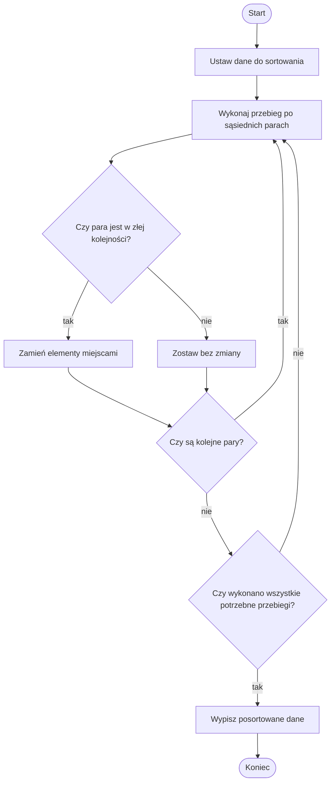

# Sortowanie bąbelkowe

## Problem po ludzku

Mamy kilka liczb ustawionych w przypadkowej kolejności. Chcemy ułożyć je od najmniejszej do największej.

Sortowanie bąbelkowe robi to bardzo prostą metodą: porównuje sąsiednie liczby i zamienia je miejscami, jeśli są w złej kolejności.

W tej lekcji przejdziemy przez algorytm stopniowo:

1. wersja podstawowa bez funkcji i bez optymalizacji,
2. wersja podstawowa umieszczona we własnej funkcji,
3. wersja zoptymalizowana bez funkcji,
4. wersja zoptymalizowana umieszczona we własnej funkcji.

Najpierw trzeba dobrze zrozumieć wersję podstawową. Optymalizacja pojawi się dopiero później.

## Prosta analogia

Wyobraź sobie uczniów stojących w szeregu według wzrostu, ale pomieszanych. Nauczyciel idzie od lewej do prawej i porównuje tylko dwie osoby obok siebie.

Jeśli wyższa osoba stoi przed niższą, zamieniają się miejscami. Po kilku przejściach coraz wyższe osoby przesuwają się w prawo.

To właśnie przypomina sortowanie bąbelkowe. Większe wartości powoli "wypływają" na koniec.

## Dane wejściowe i wynik

Dane wejściowe:

- kilka liczb w dowolnej kolejności.

Wynik:

- te same liczby ustawione rosnąco.

## Rozwiązanie krok po kroku

W wersji podstawowej działamy bardzo prosto:

1. Bierzemy pierwszą parę sąsiednich liczb.
2. Jeśli pierwsza liczba jest większa od drugiej, zamieniamy je miejscami.
3. Przechodzimy do następnej pary.
4. Dochodzimy do końca listy.
5. Cały taki przebieg powtarzamy kilka razy.
6. Po wystarczającej liczbie przebiegów lista jest uporządkowana.

## Przykład wykonany ręcznie

Dane:

```text
4 2 5 1
```

Pierwszy przebieg:

```text
4 i 2 - zła kolejność, zamiana: 2 4 5 1
4 i 5 - dobra kolejność: 2 4 5 1
5 i 1 - zła kolejność, zamiana: 2 4 1 5
```

Drugi przebieg:

```text
2 i 4 - dobra kolejność: 2 4 1 5
4 i 1 - zła kolejność, zamiana: 2 1 4 5
4 i 5 - dobra kolejność: 2 1 4 5
```

Trzeci przebieg:

```text
2 i 1 - zła kolejność, zamiana: 1 2 4 5
2 i 4 - dobra kolejność: 1 2 4 5
4 i 5 - dobra kolejność: 1 2 4 5
```

Wynik:

```text
1 2 4 5
```

## Wersja podstawowa bez funkcji

To jest najprostsza wersja algorytmu. Nie jest jeszcze sprytna, ale łatwo zrozumieć jej działanie.

Ta wersja:

- zawsze wykonuje `n - 1` pełnych przebiegów,
- w każdym przebiegu sprawdza wszystkie sąsiednie pary od początku do końca,
- nie skraca zakresu wewnętrznej pętli,
- nie sprawdza, czy podczas przebiegu wykonano zamianę,
- nie kończy pracy wcześniej nawet wtedy, gdy lista jest już uporządkowana.

Najważniejszy fragment ma postać:

```python
for i in range(liczbaElementow - 1):
    for j in range(liczbaElementow - 1):
```

Zmienna `i` oznacza numer przebiegu. Zmienna `j` oznacza miejsce porównywanej pary.

Jeśli lista ma `4` elementy, to `liczbaElementow - 1` wynosi `3`. Program wykona więc `3` przebiegi. W każdym przebiegu sprawdzi `3` pary sąsiednich elementów.

## Implementacja w Pythonie - wersja podstawowa bez funkcji

<details markdown="1">
<summary>Pokaż implementację w Pythonie</summary>

```python
liczby = [4, 2, 5, 1]

liczbaElementow = len(liczby)

for i in range(liczbaElementow - 1):
    for j in range(liczbaElementow - 1):
        if liczby[j] > liczby[j + 1]:
            pomocnicza = liczby[j]
            liczby[j] = liczby[j + 1]
            liczby[j + 1] = pomocnicza

print("Posortowane liczby:", liczby)
```

</details>

## Jak czytać wersję podstawową

Fragment:

```python
if liczby[j] > liczby[j + 1]:
```

czytamy tak:

Sprawdź, czy liczba po lewej stronie jest większa od liczby po prawej stronie.

Jeżeli jest większa, liczby są w złej kolejności i trzeba je zamienić miejscami.

Fragment:

```python
pomocnicza = liczby[j]
liczby[j] = liczby[j + 1]
liczby[j + 1] = pomocnicza
```

używa zmiennej pomocniczej. Dzięki niej nie gubimy jednej z wartości podczas zamiany.

## Wersja podstawowa we własnej funkcji

Gdy rozumiemy już wersję podstawową, możemy umieścić ją w funkcji.

Funkcja pozwala nadać algorytmowi nazwę. Dzięki temu później możemy napisać:

```python
sortowanie_babelkowe_podstawowe(liczby)
```

i wiadomo, co ma się wydarzyć.

W tej wersji algorytm nadal jest taki sam jak wcześniej. Nie dodajemy jeszcze optymalizacji. Zmieniamy tylko sposób organizacji kodu.

## Implementacja w Pythonie - wersja podstawowa w funkcji

<details markdown="1">
<summary>Pokaż implementację w Pythonie</summary>

```python
def sortowanie_babelkowe_podstawowe(liczby):
    liczbaElementow = len(liczby)

    for i in range(liczbaElementow - 1):
        for j in range(liczbaElementow - 1):
            if liczby[j] > liczby[j + 1]:
                pomocnicza = liczby[j]
                liczby[j] = liczby[j + 1]
                liczby[j + 1] = pomocnicza


liczby = [4, 2, 5, 1]

sortowanie_babelkowe_podstawowe(liczby)

print("Posortowane liczby:", liczby)
```

</details>

## Dopiero teraz: co można poprawić?

Wersja podstawowa działa, ale wykonuje niepotrzebne porównania.

Po pierwszym przebiegu największy element trafia na koniec. Nie trzeba już porównywać go ponownie.

Po drugim przebiegu drugi największy element jest już na swoim miejscu. Jego też nie trzeba dalej sprawdzać.

Można więc skracać zakres wewnętrznej pętli.

Druga poprawa jest jeszcze prostsza. Jeśli w całym przebiegu nie było żadnej zamiany, to lista jest już uporządkowana. Wtedy można zakończyć algorytm wcześniej.

## Wersja zoptymalizowana bez funkcji

Ta wersja nadal jest zapisana bez funkcji, ale działa sprytniej.

Wprowadza dwie zmiany:

- wewnętrzna pętla ma krótszy zakres: `liczbaElementow - 1 - i`,
- zmienna `czyBylaZamiana` sprawdza, czy w danym przebiegu wykonano jakąkolwiek zamianę.

Jeśli nie było zamiany, lista jest już posortowana i można użyć `break`.

## Implementacja w Pythonie - wersja zoptymalizowana bez funkcji

<details markdown="1">
<summary>Pokaż implementację w Pythonie</summary>

```python
liczby = [4, 2, 5, 1]

liczbaElementow = len(liczby)

for i in range(liczbaElementow - 1):
    czyBylaZamiana = False

    for j in range(liczbaElementow - 1 - i):
        if liczby[j] > liczby[j + 1]:
            pomocnicza = liczby[j]
            liczby[j] = liczby[j + 1]
            liczby[j + 1] = pomocnicza
            czyBylaZamiana = True

    if czyBylaZamiana == False:
        break

print("Posortowane liczby:", liczby)
```

</details>

## Jak czytać optymalizację

Fragment:

```python
for j in range(liczbaElementow - 1 - i):
```

czytamy tak:

Porównuj tylko tę część listy, która może być jeszcze nieuporządkowana.

Fragment:

```python
czyBylaZamiana = False
```

oznacza:

Na początku przebiegu zakładamy, że nie było żadnej zamiany.

Jeśli program wykona zamianę, ustawiamy:

```python
czyBylaZamiana = True
```

Jeżeli po całym przebiegu zmienna nadal ma wartość `False`, to lista jest już uporządkowana.

## Wersja zoptymalizowana we własnej funkcji

Na końcu możemy zapisać zoptymalizowany algorytm w funkcji.

To jest najbardziej uporządkowana wersja z tej lekcji:

- ma nazwę,
- skraca zakres porównań,
- kończy pracę wcześniej, jeśli lista jest już posortowana.

## Implementacja w Pythonie - wersja zoptymalizowana w funkcji

<details markdown="1">
<summary>Pokaż implementację w Pythonie</summary>

```python
def sortowanie_babelkowe(liczby):
    liczbaElementow = len(liczby)

    for i in range(liczbaElementow - 1):
        czyBylaZamiana = False

        for j in range(liczbaElementow - 1 - i):
            if liczby[j] > liczby[j + 1]:
                pomocnicza = liczby[j]
                liczby[j] = liczby[j + 1]
                liczby[j + 1] = pomocnicza
                czyBylaZamiana = True

        if czyBylaZamiana == False:
            break


liczby = [4, 2, 5, 1]

sortowanie_babelkowe(liczby)

print("Posortowane liczby:", liczby)
```

</details>

## Dlaczego algorytm działa

Sortowanie bąbelkowe działa, ponieważ większe elementy stopniowo przesuwają się w prawo.

Po jednym pełnym przebiegu największy element znajduje się na końcu. Po kolejnym przebiegu drugi największy element znajduje się przed nim. Po kilku przebiegach wszystkie elementy są w dobrej kolejności.

Wersja podstawowa dochodzi do wyniku przez powtarzanie pełnych przebiegów.

Wersja zoptymalizowana robi to samo, ale pomija miejsca, o których już wiemy, że są uporządkowane.

## Schemat blokowy



## Najczęstsze błędy

- Wykonanie tylko jednego przebiegu.
- Porównywanie elementów, które nie są sąsiadami.
- Zamiana elementów w złym momencie.
- Zgubienie jednej wartości podczas zamiany.
- Użycie `range(liczbaElementow)` w wewnętrznej pętli i wyjście poza zakres listy.
- Pokazanie optymalizacji bez zrozumienia wersji podstawowej.
- Mylenie wersji podstawowej z wersją zoptymalizowaną.
- Myślenie, że sortowanie bąbelkowe jest najszybszą metodą sortowania.

## Spróbuj wyjaśnić własnymi słowami

Odpowiedz na pytania:

1. Co porównuje sortowanie bąbelkowe?
2. Kiedy dwie liczby zamieniają się miejscami?
3. Dlaczego największa liczba przesuwa się na koniec?
4. Czym wersja podstawowa różni się od zoptymalizowanej?
5. Po co umieszcza się algorytm w funkcji?

## Ćwiczenia

1. Wykonaj ręcznie sortowanie liczb `3 1 4 2` metodą bąbelkową.
2. Wykonaj ręcznie sortowanie liczb `5 4 3 2 1`.
3. Wyjaśnij, kiedy następuje zamiana dwóch liczb.
4. Uruchom wersję podstawową bez funkcji i zmień dane wejściowe.
5. Uruchom wersję podstawową w funkcji.
6. Porównaj wersję podstawową i zoptymalizowaną.
7. Wyjaśnij, co oznacza zapis `liczbaElementow - 1 - i`.
8. Dopisz w programie wypisywanie listy po każdym przebiegu.
