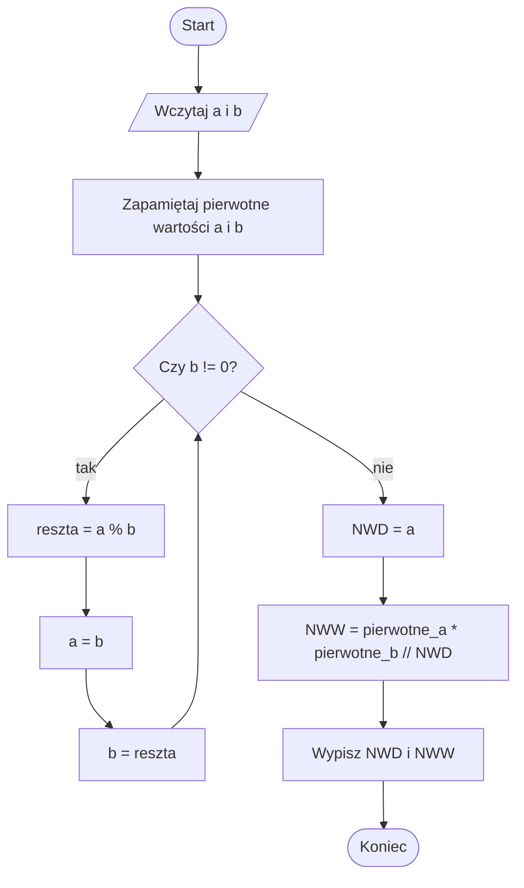

# NWD i NWW

## Problem po ludzku

Mamy dwie liczby całkowite dodatnie. Chcemy znaleźć:

- NWD, czyli największy wspólny dzielnik,
- NWW, czyli najmniejszą wspólną wielokrotność.

NWD mówi, przez jaką największą liczbę można podzielić obie liczby bez reszty.

NWW mówi, jaka jest najmniejsza dodatnia liczba, która jest wielokrotnością obu liczb.

## Prosta analogia

Wyobraź sobie dwa zestawy klocków. Chcesz podzielić oba zestawy na jak największe równe grupy. Wielkość takiej największej grupy to NWD.

NWW można porównać do pierwszego wspólnego momentu, w którym dwa rytmy spotykają się razem. Na przykład jeden rytm powtarza się co 4 uderzenia, drugi co 6 uderzeń. Spotkają się po 12 uderzeniach.

## Dane wejściowe i wynik

Dane wejściowe:

- pierwsza liczba całkowita dodatnia,
- druga liczba całkowita dodatnia.

Wynik:

- NWD tych liczb,
- NWW tych liczb.

## Rozwiązanie krok po kroku

Do obliczenia NWD użyjemy algorytmu Euklidesa.

1. Weź dwie liczby `a` i `b`.
2. Dopóki `b` nie jest równe `0`, oblicz resztę z dzielenia `a` przez `b`.
3. Zastąp `a` starą wartością `b`.
4. Zastąp `b` obliczoną resztą.
5. Gdy `b` będzie równe `0`, wartość `a` jest NWD.
6. NWW oblicz ze wzoru: `a * b / NWD`, używając pierwotnych liczb.

## Przykład wykonany ręcznie

Dane:

```text
a = 18
b = 24
```

Algorytm Euklidesa:

```text
18 % 24 = 18, więc a = 24, b = 18
24 % 18 = 6, więc a = 18, b = 6
18 % 6 = 0, więc a = 6, b = 0
```

Gdy `b = 0`, kończymy. NWD wynosi `6`.

NWW:

```text
18 * 24 / 6 = 72
```

Wynik:

```text
NWD = 6
NWW = 72
```

## Dlaczego algorytm działa

Jeżeli dwie liczby mają wspólny dzielnik, to ten dzielnik dzieli także resztę z dzielenia większej liczby przez mniejszą.

Dlatego zamiast sprawdzać wszystkie dzielniki, możemy powtarzać dzielenie z resztą. Liczby robią się coraz mniejsze, a największy wspólny dzielnik się nie zmienia.

Gdy reszta wynosi `0`, ostatnia niezerowa liczba jest największym wspólnym dzielnikiem.

## Schemat blokowy



## Najczęstsze błędy

- Zgubienie pierwotnych wartości potrzebnych do obliczenia NWW.
- Użycie zwykłego dzielenia `/` zamiast dzielenia całkowitego `//` przy NWW.
- Pomylenie reszty z dzielenia `%` z dzieleniem `/`.
- Zakończenie pętli w złym momencie.
- Obliczanie NWW bez wcześniejszego obliczenia NWD.

## Spróbuj wyjaśnić własnymi słowami

Odpowiedz na pytania:

1. Co oznacza NWD?
2. Dlaczego w algorytmie Euklidesa używamy reszty z dzielenia?
3. Po co zapamiętujemy pierwotne wartości liczb?
4. Jak obliczamy NWW, gdy znamy NWD?

## Implementacja w Pythonie

<details markdown="1">
<summary>Pokaż implementację w Pythonie</summary>

```python
a = int(input("Podaj pierwszą liczbę: "))
b = int(input("Podaj drugą liczbę: "))

pierwsza = a
druga = b

while b != 0:
    reszta = a % b
    a = b
    b = reszta

nwd = a
nww = pierwsza * druga // nwd

print("NWD wynosi:", nwd)
print("NWW wynosi:", nww)
```

</details>

## Ćwiczenia

1. Oblicz ręcznie NWD i NWW liczb `12` i `18`.
2. Oblicz ręcznie NWD i NWW liczb `15` i `20`.
3. Wyjaśnij, co oznacza zapis `a % b`.
4. Uruchom program dla kilku par liczb.
5. Sprawdź, co stanie się dla liczb, których NWD wynosi `1`.
